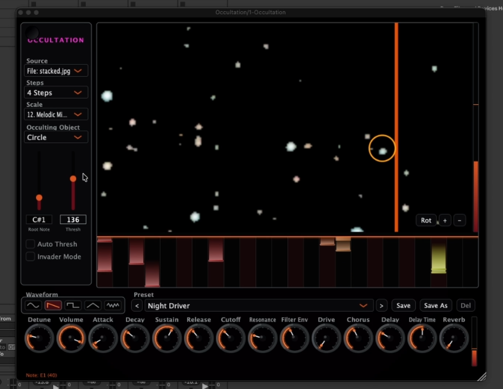

# Occultation



Occultation is an audio plugin (VST3 + Standalone, macOS) that turns light into music. It watches an image source — from a camera, a local file, a network stream, or star chart — and converts brightness into music in real time.

## How it works

The sequencer runs over the image and chooses the pitch to output depending on the brightness of the pixels, it then generates a note on the synthesizer : in other words : a cursor sweeps left to right across a bar (length set
by **Steps**), synced to host (or standalone) transport PPQ. At each step it
samples 24 horizontal lanes (or, in Sky Map mode, a vertical strip of sky at
the cursor's right ascension) and triggers whichever lane is brightest,
mapped onto the selected musical scale.


## Sources

- **Open File...** — local video (`.mp4`, `.avi`, `.mov`, `.m4v`), image
  (`.jpg`, `.png`), or FITS (`.fits`, `.fit`, `.fts`) astrophotography stacks.
  Video loops on reaching the end.
- **Sky Map** — an infinite, procedurally rendered equatorial star chart:
  ~250 real stars (correct magnitude and position), ~45 labelled
  cocnstellation figures, and the brighter Messier objects. Opens centred on
  Cassiopeia.
  - Drag to pan, scroll or pinch to zoom.
  - Panning past a pole wraps onto the opposite side of the sky (RA + 180°)
    instead of stopping — there's always more sky to reveal.
  - A "jump to constellation" picker floats over the view.
- **Network Stream...** — `rtsp://`, `rtmp://`, `http(s)://`. Captured on a
  dedicated thread so a slow or stalled stream can't stall MIDI generation;
  reconnects automatically with backoff if the connection drops.
- **Cam 0–2** — built-in/USB cameras (AVFoundation).

FITS files are read with a hand-rolled parser (no CFITSIO dependency) —
either a single-plane raw Bayer mosaic (shown undemosaiced, as mono; this
feeds brightness-driven MIDI, not a colour-accurate viewer) or a 3-plane
R/G/B stack merged to BGR. Each plane is stretched to 8-bit with a
percentile-clipped histogram, since a linear min/max crushes a single sub to
near-black.

## Zoom and pan (every mode)

Independent of source, you can zoom into a rectangle of the current frame —
the sequencer samples exactly what's on screen, at any zoom level:

- `+` / `-` buttons in the video's corner.
- Click-drag on the video to pan.
- Scroll wheel or trackpad pinch to zoom.
- Arrow keys to pan once the plugin window has focus.

Sky Map mode uses the same gestures for its own RA/Dec pan/zoom instead.

## Controls

- **Steps** — the sequencer's loop length: 64/32/16/8/4/2/1 quarter notes.
- **Scale** — 34 musical modes/scales (Lydian, major/minor, pentatonics,
  harmonic/melodic minor, whole tone, blues, and a range of exotic and
  historical modes: Hungarian minor, Neapolitan, Hirajoshi, Byzantine, etc).
- **Root note** — sets the tonic the scale is built on.
- **Threshold** — the brightness cutoff between "note" and "background".
  Auto-threshold (Otsu's method, smoothed) is on by default; disable it to
  set a fixed threshold manually. Sky Map mode fixes this at 0, since it
  samples the star catalog directly rather than pixel brightness.
- **Play/Stop** — stopping the transport (the host's, or this button in
  Standalone) silences the plugin completely: the synth engine is reset, which
  kills held voices, their envelopes, the reverb/delay tails and any invader SFX
  still ringing, an All Notes Off goes out of the MIDI port for anything
  downstream, and nothing is synthesized at all until playback resumes. So
  Invader mode makes no sound while stopped either — press Play to hear it.
  In Standalone this button drives a simulated transport (spacebar shortcut
  included) since there's no host to sync to. The
  standalone app can't see another application's transport directly — it's
  just a process sending MIDI out (e.g. via an IAC bus) — but it does watch
  its own MIDI *input* for realtime Start/Continue/Stop and will follow a
  DAW's transport if you loop the DAW's MIDI clock back into this app's
  input (a second IAC bus, enabled under Options > Audio/MIDI Settings).

The piano roll below the video shows recent note history: pitch runs left
(low) to right (high), time runs top (now) to bottom (aging out).

**Glide** (synth panel, after Volume) is portamento: each note slides from the
previous one over that many seconds, 0 being off. The slide runs in log pitch
rather than in Hz, so it's even in semitones — a straight line in Hz from C3 to
C5 spends most of its time in the top octave and arrives with a lurch. It's
monophonic by nature, sliding from the last note played whichever voice takes
the new one, which suits a sequencer feeding the engine one note at a time.
Like Volume, it isn't part of the factory presets — those set a voice's
character, not how it's performed — but it is saved with a user preset.

## Invader mode

A small ship flies over whatever source is showing. **Left/right steer**,
**up/down are the throttle** (up faster, down slower), **Space fires**. Steering
and speed are separate controls rather than four directions of push, so the ship
can be turned on the spot to line up a shot, and held at a speed through a curve
to graze a line of stars without a key held down for propulsion.

Exactly two things move the ship and they don't interact: left/right set the
heading, up/down set the speed, and it travels along its nose at precisely that
speed. Both constants sit at the top of `updateShipPhysics` — turning runs at
~230°/second (`turnDegreesPerTick`, a full 180° in about eight tenths of a
second) and the throttle takes ~1.5s from a standstill to full speed and the
same to stop (`speedChangePerTick`). Target speed is held when no key is down,
so it's a cruise setting rather than a push, and flying into an edge holds the
ship there until it's steered away. The sequencer keeps running underneath it;
this is a second way to play the same source, not a source of its own. Every
note it makes is musical rather than sci-fi decoration:

- **Aiming is pitch.** A hit plays a short ascending run starting from the lane
  it landed in, using the same 24 horizontal lanes and the same top-is-high
  mapping the sequencer samples with — so a hit high in the frame sounds high,
  and brightness sets the velocity exactly as it does for a sequenced note.
- **Shooting erases.** Hits punch craters into a damage mask that's subtracted
  from what the sequencer reads *and* from the picture, so a star you shoot
  drops out of the loop and visibly leaves a hole. In Sky Map mode, where the
  sequencer queries the star catalog directly rather than sampling pixels, the
  catalog lookup consults the same mask. Craters heal over ~4 seconds, so the
  loop thins out under sustained fire and fills back in when you stop — it's a
  performance gesture, not a one-way trip to an empty bar. The source image
  itself is never modified (`healPerTick` in `applyInvaderDamage` is the one
  constant to change for permanent destruction).
- **Hits bloom into a plasma ball.** A two-second demoscene-style explosion
  (`drawPlasmaBall`), centred where the bullet struck: four interfering sine
  fields wrapped onto a sphere, with the ridges where they cancel burning to
  white as filaments, a violet-to-cyan palette, a specular highlight and a rim
  reflection. It zooms to half the frame's shorter side in under a third of a
  second, then hangs and dissolves over the rest — half transparent throughout,
  thinner between the filaments than along them, so whatever was behind it shows
  through. The field is computed into a 128px tile and scaled up rather than
  evaluated per output pixel; that keeps it at ~1.4ms a ball at that size, and
  at most 6 are drawn at once (twelve would be over half the ~30ms capture tick,
  and at this size they'd be visual mush anyway).
  Bullets leave the ship's nose and arm two ticks out, so an explosion always
  happens where the shot landed — without the arming delay, firing while the
  hull overlapped anything bright (most of the time, since grazing rewards
  exactly that) detonated on the ship itself.
- **Only real objects can be hit.** A bullet sweeps the whole segment it
  travels each tick, sampling every ~2 pixels, and detonates at the first
  pixel *above* the threshold — the same strictly-greater test the sequencer
  uses. Sweeping matters more than it sounds: a bullet crosses ~67 pixels of a
  1920-wide frame per tick while a star is 2-7 across, so the old single
  sample at each tick's landing point jumped clean over them. Measured against
  a real sky-map frame, a shot aimed straight at a star connected 33% of the
  time; sweeping makes it 100%. The explosion, the crater and the note's pitch
  all use the point along the path where it actually struck, not where the tick
  ended — so the gun and the sequencer agree about what counts as an
  object. Sky Map mode needs its own number (`skyMapStarThreshold`, 120):
  the shared threshold is pinned to 0 there, since the star sampler reads the
  catalog rather than pixels, and at 0 every pixel of empty black sky was a
  target. 120 sits above the constellation figures (~63), Messier ellipses
  (~87) and labels (~113) but below every star core (125–255), so shots
  detonate on stars and nothing else.
- **The engine sounds when the ship works.** The exhaust trails and their
  6-note "engine hum" run only while the throttle is actually opening the ship
  up — not while coasting at a held speed, braking, or merely turning.
- **Everything lands on the grid.** Impacts, grazes and the engine hum are
  scheduled against the sequencer's own PPQ timeline — onsets snapped to 1/16,
  runs stepping in 1/32 — instead of firing on whatever ~30ms tick the keypress
  happened to fall on. With no transport running they fall back to tick spacing,
  so the mode still plays with the sequencer stopped.
- **The laser harmonises.** Each shot picks a third, fifth or seventh above
  whatever note the sequencer is sounding right now, counted in scale degrees so
  it stays inside the selected mode, then transposed up two octaves.
- **Time of flight is note length.** The laser's note is held for its bullet's
  whole flight and released when it hits or leaves the frame: a shot across the
  frame rings out, a point-blank hit stabs. Firing while accelerating forwards
  also pitches the zap up (the synthesized sweep only — bending the MIDI note
  would drag the sequencer's notes with it on a shared channel).
- **Grazing.** Flying *through* a bright region arpeggiates it without
  destroying it — one note every ~120ms, still quantised. Legato lines from
  flight, percussive hits from the gun.
- **Streak Mod.** (checkbox, appears only while Invader mode is on) Consecutive
  hits with no miss transpose the invader layer up a scale degree each, and
  every 8 hits push it onto a more strung-out mode (harmonic minor → Hungarian
  minor → Byzantine → altered). A miss resets it; the count shows on the
  checkbox. Only the invader layer moves — the sequencer stays on the scale you
  chose, so a streak reads as a counter-melody rising against fixed backing
  rather than the whole piece lurching key. Off by default, because moving notes
  away from the chosen Scale/Root is the last thing you want if you're using
  Invader mode as a controlled layer.

## Building

Requires CMake, a C++17 toolchain, OpenCV 5, and `dylibbundler`. JUCE is
fetched automatically via `FetchContent` on first configure (slow once,
cached after).

```
brew install opencv dylibbundler
cmake -S . -B build
cmake --build build -j 8
```

That is enough to compile it and try it locally. Configure will warn that
it is falling back to the system OpenCV; two things are worth knowing
before you rely on such a build:

- Homebrew's OpenCV links OpenBLAS, which links libomp. dylibbundler then
  copies libomp into *every* plugin bundle, and a host that loads two of
  our formats at once (Ableton scanning the VST3 and the AU together) gets
  two libomp images at two paths. LLVM's OpenMP calls `abort()` on
  duplicate registration and takes the host down with it.
- Homebrew bottles are built for the build machine's own macOS, and
  dyld enforces each bundled dylib's `LC_BUILD_VERSION` at load time — so
  the plugin only runs on machines at least as new as the one that built it.

### Building for distribution

Both problems come from the bottles, so release builds use OpenCV and
FFmpeg compiled from source: static OpenCV with no OpenMP/LAPACK (no libomp
anywhere in the graph), and a decode-only LGPL FFmpeg with no external
codec libraries, both targeting macOS 11.

FFmpeg first — 7.1.x specifically, because OpenCV 5.0 still reads
`AVCodec::pix_fmts`, which FFmpeg 8 deprecated and 9 removed:

```
./configure --prefix="$HOME/Documents/dev/ffmpeg-lean/install" \
    --enable-shared --disable-static \
    --disable-everything --disable-programs --disable-doc \
    --disable-avdevice --disable-avfilter --disable-postproc \
    --disable-libxcb --disable-sdl2 --disable-xlib \
    --disable-vaapi --disable-vdpau --disable-iconv --disable-lzma --disable-bzlib \
    --enable-network --enable-securetransport \
    --enable-protocol=file,http,https,tcp,udp,rtp,rtmp,rtmps,rtmpt,tls,crypto,hls,httpproxy \
    --enable-demuxer=rtsp,sdp,mov,flv,live_flv,mpegts,mpegtsraw,hls,matroska,avi,h264,hevc,mjpeg,mpjpeg,image2,image2pipe,asf,dshow \
    --enable-decoder=h264,hevc,mjpeg,mjpegb,mpeg4,mpeg2video,vp8,vp9,av1,rawvideo,aac,mp3,pcm_s16le \
    --enable-parser=h264,hevc,mjpeg,mpeg4video,mpegvideo,vp8,vp9,av1,aac \
    --enable-bsf=h264_mp4toannexb,hevc_mp4toannexb,extract_extradata \
    --extra-cflags="-mmacosx-version-min=11.0" \
    --extra-ldflags="-mmacosx-version-min=11.0"
make -j8 && make install
```

`--disable-libxcb --disable-sdl2 --disable-xlib` are not optional: without
them FFmpeg autodetects whatever Homebrew has installed and quietly links
libX11 into libavutil. `mpjpeg` matters too — IP cameras commonly serve
`multipart/x-mixed-replace`, and without that demuxer the stream connects
and then fails to parse.

Then OpenCV 5.0.0 against it:

```
PKG_CONFIG_LIBDIR="$HOME/Documents/dev/ffmpeg-lean/install/lib/pkgconfig" \
cmake -S opencv-5.0.0 -B ocv-build -G Ninja \
    -DCMAKE_BUILD_TYPE=Release \
    -DCMAKE_INSTALL_PREFIX="$HOME/Documents/dev/opencv-lean/install" \
    -DCMAKE_OSX_DEPLOYMENT_TARGET=11.0 -DCMAKE_OSX_ARCHITECTURES=arm64 \
    -DBUILD_SHARED_LIBS=OFF -DBUILD_LIST=core,imgproc,imgcodecs,videoio,flann \
    -DWITH_FFMPEG=ON -DWITH_AVFOUNDATION=ON -DOPENCV_FFMPEG_ENABLE_LIBAVDEVICE=OFF \
    -DWITH_OPENMP=OFF -DWITH_LAPACK=OFF -DWITH_EIGEN=OFF \
    -DWITH_PROTOBUF=OFF -DBUILD_PROTOBUF=OFF \
    -DBUILD_TESTS=OFF -DBUILD_PERF_TESTS=OFF -DBUILD_EXAMPLES=OFF \
    -DBUILD_opencv_apps=OFF -DBUILD_DOCS=OFF -DBUILD_JAVA=OFF -DBUILD_opencv_python3=OFF
cmake --build ocv-build -j8 && cmake --install ocv-build
```

`PKG_CONFIG_LIBDIR`, not `PKG_CONFIG_PATH` — the latter only prepends, so
OpenCV finds Homebrew's FFmpeg anyway and the floor goes straight back up.
`WITH_EIGEN`/`WITH_PROTOBUF` off because either one makes the installed
`OpenCVModules.cmake` export a link-interface target this project would
then have to resolve, and protobuf's names a library the lean build never
installs.

CMake picks both up automatically from those paths (override with
`OCCULTATION_OPENCV_ROOT` / `OCCULTATION_FFMPEG_ROOT`). Configure then
reports the floor it actually measured from the binaries:

```
-- Occultation: dependencies allow macOS 11.0+ on arm64 (floor from OpenCV)
```

## Running

- **Standalone**: `open build/OccultationPlugin_artefacts/Release/Standalone/Occultation.app`
- **VST3**: built to `build/OccultationPlugin_artefacts/Release/VST3/Occultation.vst3`,
  then a post-build step copies and ad-hoc codesigns it into
  `~/Library/Audio/Plug-Ins/VST3/Occultation.vst3` for hosts like Ableton Live to pick up automatically.


## TODO:
- build and release for Windows & Linux

   
## More info

Have a look on https://apokrypsi.com/occultation


